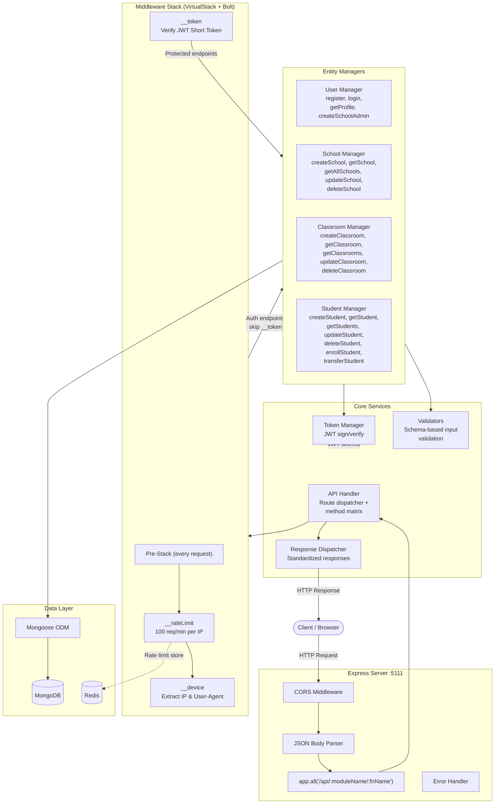
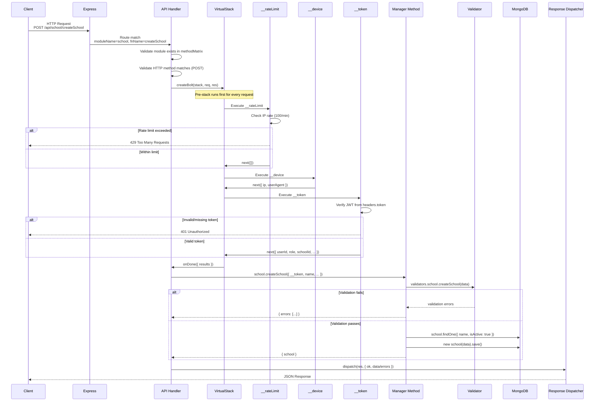
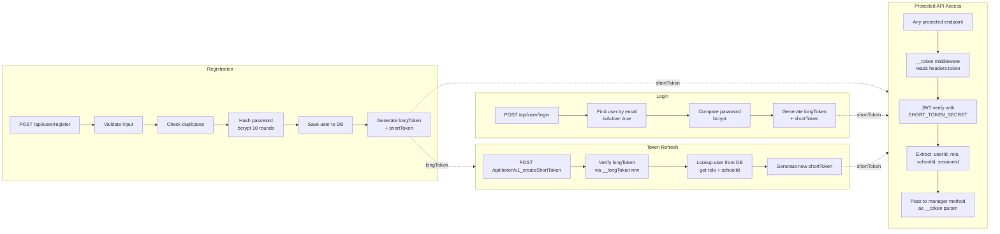
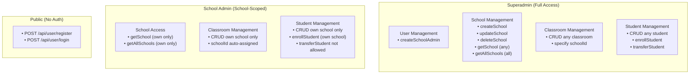
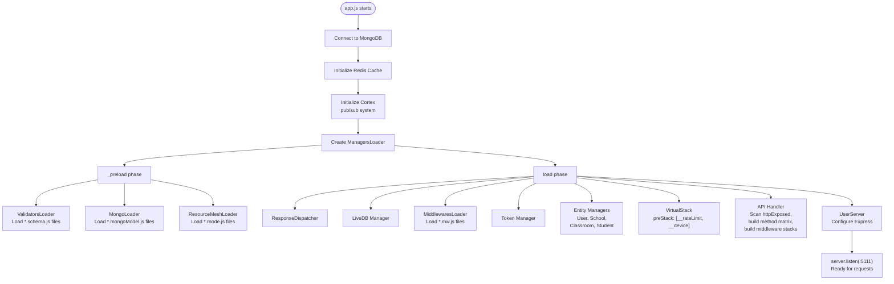
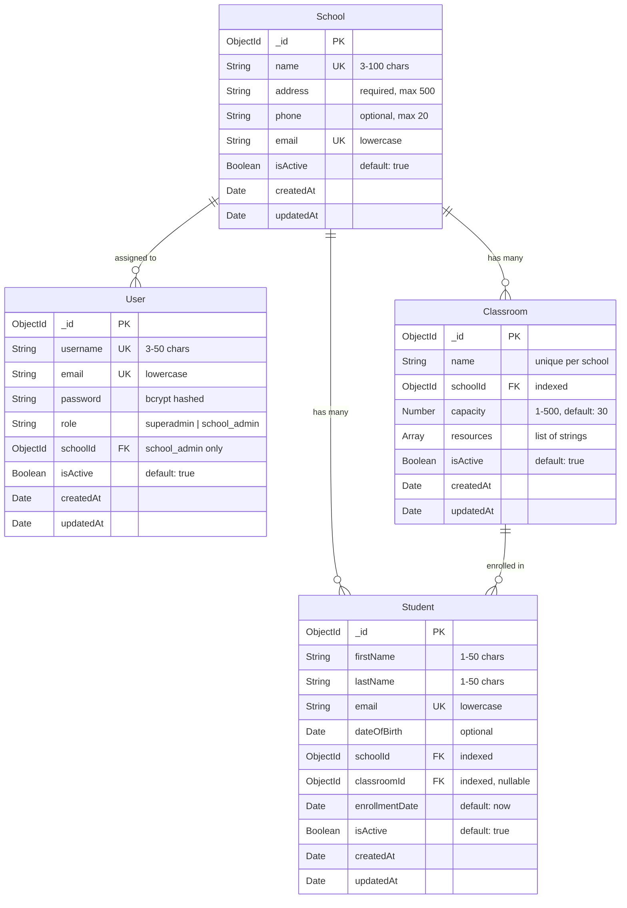

# School Management System API

A RESTful API for managing schools, classrooms, and students with role-based access control (RBAC).

## Features

- **Role-Based Access Control (RBAC)**
  - **Superadmin**: Full system access - can manage all schools, classrooms, and students
  - **School Admin**: School-specific access - can only manage their assigned school's resources

- **Entity Management**
  - Schools: CRUD operations (Superadmin only)
  - Classrooms: CRUD operations with capacity management
  - Students: CRUD operations with enrollment and transfer capabilities

- **Security**
  - JWT-based authentication (long token + short token system)
  - API rate limiting (100 requests/minute per IP)
  - Input validation on all endpoints
  - Password hashing with bcrypt
  - Soft deletes to preserve data integrity

## Tech Stack

- **Runtime**: Node.js
- **Framework**: Express.js
- **Database**: MongoDB with Mongoose ODM
- **Caching**: Redis
- **Authentication**: JWT (jsonwebtoken)
- **Testing**: Jest + Supertest + MongoMemoryServer

## Installation

### Prerequisites

- Node.js (v16 or higher)
- MongoDB (v5 or higher)
- Redis (v6 or higher)

### Setup

1. Clone the repository:
```bash
git clone <repository-url>
cd axion
```

2. Install dependencies:
```bash
npm install
```

3. Create environment file:
```bash
cp .env.example .env
```

4. Update `.env` with your configuration:
```env
MONGO_URI=mongodb://localhost:27017/school_management
REDIS_URI=redis://127.0.0.1:6379
LONG_TOKEN_SECRET=your-secure-long-token-secret
SHORT_TOKEN_SECRET=your-secure-short-token-secret
NACL_SECRET=your-nacl-secret
```

5. Start the server:
```bash
npm start
```

The API will be available at `http://localhost:5111`

### Running Tests

```bash
npm test
```

Tests use an in-memory MongoDB instance (MongoMemoryServer) so no external database is needed.

---

## Deployment

### Production Deployment

1. **Set environment variables** for production:
```env
ENV=production
USER_PORT=5111
MONGO_URI=mongodb+srv://<user>:<pass>@<cluster>.mongodb.net/school_management
REDIS_URI=redis://<host>:6379
LONG_TOKEN_SECRET=<strong-random-secret-min-32-chars>
SHORT_TOKEN_SECRET=<different-strong-random-secret>
NACL_SECRET=<another-strong-random-secret>
```

2. **Install production dependencies**:
```bash
npm install --production
```

3. **Start with a process manager** (recommended):
```bash
# Using PM2
npm install -g pm2
pm2 start app.js --name school-api

# Or using Docker (if Dockerfile is provided)
docker build -t school-api .
docker run -p 5111:5111 --env-file .env school-api
```

4. **Verify** the server is running:
```bash
curl http://localhost:5111/api/user/login
```

### Production Checklist

- [ ] Use strong, unique secrets for all `*_SECRET` env vars (min 32 characters)
- [ ] Use a managed MongoDB instance (Atlas, DocumentDB, etc.)
- [ ] Use a managed Redis instance (ElastiCache, Redis Cloud, etc.)
- [ ] Set `ENV=production`
- [ ] Run behind a reverse proxy (nginx) with HTTPS
- [ ] Enable MongoDB authentication and use connection strings with credentials

---

## System Architecture



---

## Request Lifecycle



---

## Authentication Flow



### Token Types

| Token | Purpose | Lifetime | Contents |
|-------|---------|----------|----------|
| Long Token | Master key, used to generate short tokens | 3 years | userId, userKey |
| Short Token | Used for all API requests | 1 year | userId, userKey, role, schoolId, sessionId, deviceId |

---

## Role-Based Access Control



---

## Boot Sequence



---

## API Documentation

### Base URL
```
http://localhost:5111/api
```

### Authentication

All protected endpoints require a JWT token in the `token` header:
```
token: <your-short-token>
```

---

### Authentication Endpoints

#### Register User
```http
POST /api/user/register
```
**Body:**
```json
{
  "username": "admin",
  "email": "admin@example.com",
  "password": "securepassword123",
  "role": "superadmin"
}
```
**Response:**
```json
{
  "ok": true,
  "data": {
    "user": { "username": "admin", "email": "admin@example.com", "role": "superadmin" },
    "longToken": "eyJhbGciOiJIUzI1NiIs...",
    "shortToken": "eyJhbGciOiJIUzI1NiIs..."
  }
}
```

#### Login
```http
POST /api/user/login
```
**Body:**
```json
{
  "email": "admin@example.com",
  "password": "securepassword123"
}
```
**Response:**
```json
{
  "ok": true,
  "data": {
    "user": { "username": "admin", "email": "admin@example.com", "role": "superadmin" },
    "longToken": "...",
    "shortToken": "..."
  }
}
```

#### Get Profile (Protected)
```http
GET /api/user/getProfile
Headers: token: <short-token>
```

#### Create School Admin (Superadmin only)
```http
POST /api/user/createSchoolAdmin
Headers: token: <short-token>
```
**Body:**
```json
{
  "username": "schooladmin",
  "email": "schooladmin@school.com",
  "password": "password123",
  "schoolId": "<school-id>"
}
```

---

### School Endpoints (Superadmin only for create/update/delete)

#### Create School
```http
POST /api/school/createSchool
Headers: token: <short-token>
```
**Body:**
```json
{
  "name": "Springfield Elementary",
  "address": "123 Education St, Springfield",
  "phone": "+1234567890",
  "email": "info@springfield.edu"
}
```

#### Get School
```http
GET /api/school/getSchool?schoolId=<school-id>
Headers: token: <short-token>
```

#### Get All Schools
```http
GET /api/school/getAllSchools
Headers: token: <short-token>
```

#### Update School
```http
PUT /api/school/updateSchool
Headers: token: <short-token>
```
**Body:**
```json
{
  "schoolId": "<school-id>",
  "name": "Updated School Name",
  "address": "New Address"
}
```

#### Delete School
```http
DELETE /api/school/deleteSchool
Headers: token: <short-token>
```
**Body:**
```json
{
  "schoolId": "<school-id>"
}
```
*Note: Cannot delete a school that has classrooms or students. Remove them first.*

---

### Classroom Endpoints

#### Create Classroom
```http
POST /api/classroom/createClassroom
Headers: token: <short-token>
```
**Body:**
```json
{
  "name": "Class 1A",
  "capacity": 30,
  "resources": ["Projector", "Whiteboard", "Computer"],
  "schoolId": "<school-id>"
}
```
*Note: School admins don't need to provide schoolId - it uses their assigned school.*

#### Get Classroom
```http
GET /api/classroom/getClassroom?classroomId=<classroom-id>
Headers: token: <short-token>
```

#### Get Classrooms
```http
GET /api/classroom/getClassrooms?schoolId=<school-id>
Headers: token: <short-token>
```

#### Update Classroom
```http
PUT /api/classroom/updateClassroom
Headers: token: <short-token>
```
**Body:**
```json
{
  "classroomId": "<classroom-id>",
  "name": "Updated Class Name",
  "capacity": 35
}
```

#### Delete Classroom
```http
DELETE /api/classroom/deleteClassroom
Headers: token: <short-token>
```
**Body:**
```json
{
  "classroomId": "<classroom-id>"
}
```
*Note: Cannot delete a classroom with enrolled students. Transfer them first.*

---

### Student Endpoints

#### Create Student
```http
POST /api/student/createStudent
Headers: token: <short-token>
```
**Body:**
```json
{
  "firstName": "John",
  "lastName": "Doe",
  "email": "john.doe@student.com",
  "dateOfBirth": "2010-05-15",
  "schoolId": "<school-id>",
  "classroomId": "<classroom-id>"
}
```

#### Get Student
```http
GET /api/student/getStudent?studentId=<student-id>
Headers: token: <short-token>
```

#### Get Students
```http
GET /api/student/getStudents?schoolId=<school-id>&classroomId=<classroom-id>
Headers: token: <short-token>
```

#### Update Student
```http
PUT /api/student/updateStudent
Headers: token: <short-token>
```
**Body:**
```json
{
  "studentId": "<student-id>",
  "firstName": "Jane",
  "lastName": "Smith"
}
```

#### Delete Student
```http
DELETE /api/student/deleteStudent
Headers: token: <short-token>
```
**Body:**
```json
{
  "studentId": "<student-id>"
}
```

#### Enroll Student in Classroom
```http
POST /api/student/enrollStudent
Headers: token: <short-token>
```
**Body:**
```json
{
  "studentId": "<student-id>",
  "classroomId": "<classroom-id>"
}
```

#### Transfer Student (Superadmin only)
```http
POST /api/student/transferStudent
Headers: token: <short-token>
```
**Body:**
```json
{
  "studentId": "<student-id>",
  "targetSchoolId": "<school-id>",
  "targetClassroomId": "<classroom-id>"
}
```

---

## Response Format

### Success Response
```json
{
  "ok": true,
  "data": { ... },
  "errors": [],
  "message": ""
}
```

### Error Response
```json
{
  "ok": false,
  "data": {},
  "errors": "Error message or validation errors",
  "message": ""
}
```

### HTTP Status Codes

| Code | Description |
|------|-------------|
| `200` | Success |
| `400` | Bad Request / Validation Error |
| `401` | Unauthorized (missing or invalid token) |
| `429` | Too Many Requests (Rate Limited) |
| `500` | Internal Server Error |

### Error Codes Reference

| Error | When |
|-------|------|
| `unauthorized` | Missing or invalid JWT token |
| `Invalid credentials` | Wrong email or password on login |
| `User with this username or email already exists` | Duplicate registration |
| `Only superadmins can create schools` | School admin tries admin-only action |
| `Access denied to this school` | School admin tries to access another school |
| `School not found` | Invalid or deleted school ID |
| `Classroom is at full capacity` | Enrollment exceeds classroom capacity |
| `Cannot delete school with existing classrooms or students` | Delete school with children |
| `Cannot delete classroom with enrolled students` | Delete classroom with students |
| `Only superadmins can transfer students between schools` | School admin tries transfer |
| `Too many requests. Please try again later.` | Rate limit exceeded |

---

## Database Schema

### Entity Relationship Diagram



### Unique Indexes

| Entity | Index |
|--------|-------|
| User | `(username)`, `(email)` |
| School | `(name)`, `(email)` |
| Classroom | `(name, schoolId)` compound unique |
| Student | `(email)` |

### Schema Details

#### User
| Field | Type | Constraints |
|-------|------|-------------|
| username | String | unique, required, 3-50 chars |
| email | String | unique, required, lowercase |
| password | String | required, min 8 chars, bcrypt hashed |
| role | String | enum: `superadmin`, `school_admin` |
| schoolId | ObjectId | ref: School, required for school_admin |
| isActive | Boolean | default: true |

#### School
| Field | Type | Constraints |
|-------|------|-------------|
| name | String | unique, required, 3-100 chars |
| address | String | required, max 500 chars |
| phone | String | optional, max 20 chars |
| email | String | unique, required, lowercase |
| isActive | Boolean | default: true |

#### Classroom
| Field | Type | Constraints |
|-------|------|-------------|
| name | String | required, 1-100 chars |
| schoolId | ObjectId | ref: School, required, indexed |
| capacity | Number | default: 30, range: 1-500 |
| resources | [String] | array of resource names |
| isActive | Boolean | default: true |

#### Student
| Field | Type | Constraints |
|-------|------|-------------|
| firstName | String | required, 1-50 chars |
| lastName | String | required, 1-50 chars |
| email | String | unique, required, lowercase |
| dateOfBirth | Date | optional |
| schoolId | ObjectId | ref: School, required, indexed |
| classroomId | ObjectId | ref: Classroom, optional, indexed |
| enrollmentDate | Date | default: Date.now |
| isActive | Boolean | default: true |

---

## Rate Limiting

The API implements rate limiting with the following defaults:
- **Window**: 60 seconds
- **Max Requests**: 100 per window per IP

Rate limit headers are included in responses:
- `X-RateLimit-Limit`: Maximum requests allowed
- `X-RateLimit-Remaining`: Remaining requests in current window
- `X-RateLimit-Reset`: Unix timestamp when the window resets

---

## Security Considerations

1. **JWT Tokens**: Use strong, unique secrets for `LONG_TOKEN_SECRET` and `SHORT_TOKEN_SECRET`
2. **Password Storage**: All passwords are hashed using bcrypt with 10 salt rounds
3. **Input Validation**: All inputs are validated before processing using schema-based validators
4. **Role-Based Access**: Strict RBAC prevents unauthorized access to resources
5. **Rate Limiting**: Protects against brute force and DoS attacks with automatic cleanup
6. **Soft Deletes**: Records are deactivated rather than permanently deleted, preserving data integrity

### Known Issue: Open Superadmin Registration

The `POST /api/user/register` endpoint currently allows callers to specify any `role`, including `superadmin`. This means any anonymous user can self-register as a superadmin and gain full system access.

**Why it exists**: The endpoint is designed for initial bootstrapping so the first superadmin can be created without requiring a pre-seeded database.

**Recommended fix for production**: Remove the `role` parameter from `register` entirely. The endpoint should always create `school_admin` users. The initial superadmin should be created via one of:
- **Seed script**: A one-time CLI command that inserts the superadmin directly into the database during deployment.
- **Environment-based bootstrap**: On first startup, check if any superadmin exists. If not, create one from `ADMIN_EMAIL` / `ADMIN_PASSWORD` environment variables.

After the first superadmin exists, additional superadmins can be created through an authenticated, superadmin-only endpoint.

### Security Audit: Issues Identified & Resolved

During a code review, the following security and correctness issues were identified and fixed:

| # | Severity | Issue | Resolution |
|---|----------|-------|------------|
| 1 | **Critical** | `v1_createShortToken` generated tokens missing `role` and `schoolId`, causing all authorization checks to fail | Token manager now looks up the user from the database to populate `role` and `schoolId` in short tokens |
| 2 | **High** | Express error handler was registered before route handlers and never caught any errors | Moved error handler after `app.all()` route registration |
| 3 | **High** | GET endpoints received no parameters because only `req.body` was read (empty for GET requests) | API handler now merges `req.query` with `req.body`, so GET endpoints receive query string parameters |
| 4 | **Medium** | `NACL_SECRET` was validated at startup but never exported in `config.dotEnv`, making it inaccessible | Added `NACL_SECRET` to the config export |
| 5 | **Medium** | Registration only returned a `longToken` but all protected endpoints require a `shortToken` | `register` now returns both `longToken` and `shortToken` |
| 6 | **Medium** | Rate limiter stored entries in an in-memory Map that was never cleaned up, causing a memory leak | Added a periodic cleanup interval (every 5 minutes) that purges expired entries |
| 7 | **Medium** | `isActive` field existed on all models but was never checked in queries, and deletes were hard deletes | All queries now filter by `isActive: true`; all delete operations use soft delete (`isActive = false`) |
| 8 | **Low** | Capacity validation allowed values 1-999 (by digit count) while the Mongoose schema capped at 500 | Aligned the schema validator to enforce the 1-500 range |
| 9 | **Low** | Update methods used falsy checks (`if (name)`) which prevented setting fields to legitimate falsy values | Changed all update checks to `if (field !== undefined)` |
| 10 | **Low** | Duplicate middleware: `__shortToken.mw.js` and `__token.mw.js` both verified short tokens | Removed the unused `__shortToken.mw.js` (all managers use `__token`) |

---

## Testing

The project includes comprehensive tests covering all API endpoints:

```
Tests:       64 passed, 64 total
Test Suites: 4 passed, 4 total
```

| Suite | Tests | Coverage |
|-------|-------|----------|
| User | 14 | Registration, login, profile, school admin creation |
| School | 14 | CRUD operations, RBAC, soft delete |
| Classroom | 15 | CRUD, auto-scoping, capacity, school validation |
| Student | 21 | CRUD, enrollment, transfer, capacity limits, RBAC |

Run tests with:
```bash
npm test
```

---

## License

ISC
