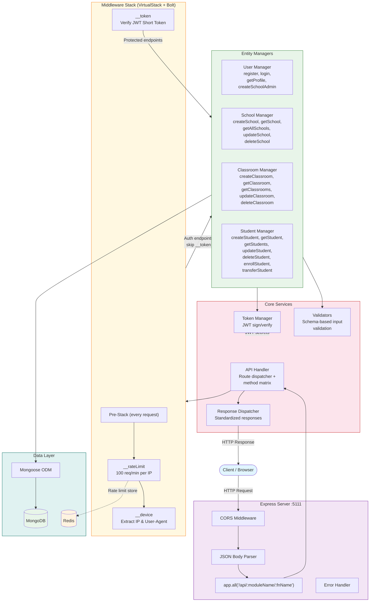
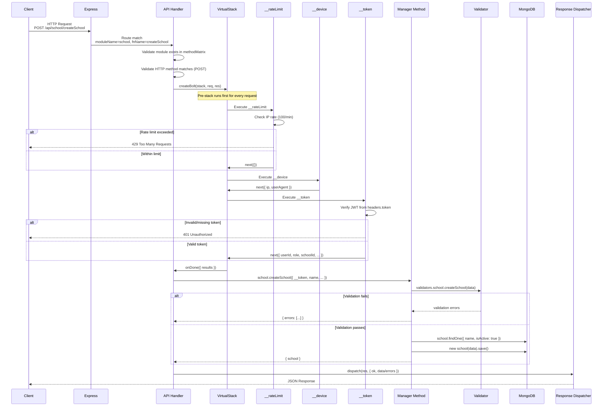
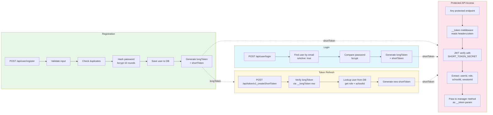
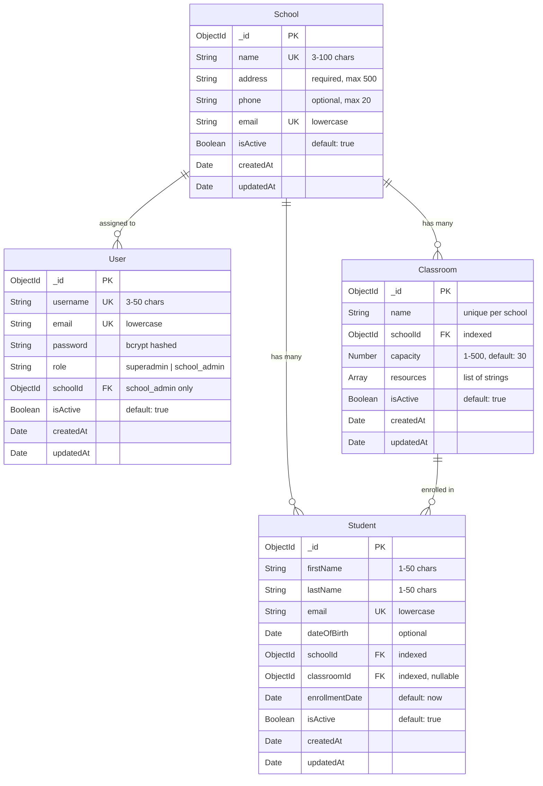
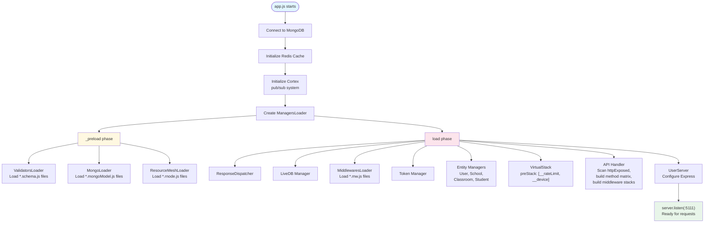

# System Architecture Diagrams

## High-Level Architecture

```mermaid
graph TB
    Client([Client / Browser])

    subgraph Express["Express Server :5111"]
        CORS[CORS Middleware]
        JSON[JSON Body Parser]
        Route["app.all('/api/:moduleName/:fnName')"]
        ErrorHandler[Error Handler]
    end

    subgraph MiddlewareStack["Middleware Stack (VirtualStack + Bolt)"]
        direction TB
        PreStack["Pre-Stack (every request)"]
        RateLimit["__rateLimit<br/>100 req/min per IP"]
        Device["__device<br/>Extract IP & User-Agent"]
        Token["__token<br/>Verify JWT Short Token"]
        PreStack --> RateLimit --> Device
    end

    subgraph Managers["Entity Managers"]
        UserMgr["User Manager<br/>register, login,<br/>getProfile, createSchoolAdmin"]
        SchoolMgr["School Manager<br/>createSchool, getSchool,<br/>getAllSchools, updateSchool,<br/>deleteSchool"]
        ClassroomMgr["Classroom Manager<br/>createClassroom, getClassroom,<br/>getClassrooms, updateClassroom,<br/>deleteClassroom"]
        StudentMgr["Student Manager<br/>createStudent, getStudent,<br/>getStudents, updateStudent,<br/>deleteStudent, enrollStudent,<br/>transferStudent"]
    end

    subgraph Core["Core Services"]
        ApiHandler["API Handler<br/>Route dispatcher +<br/>method matrix"]
        TokenMgr["Token Manager<br/>JWT sign/verify"]
        ResponseDisp["Response Dispatcher<br/>Standardized responses"]
        Validators["Validators<br/>Schema-based input<br/>validation"]
    end

    subgraph Data["Data Layer"]
        Mongoose["Mongoose ODM"]
        MongoDB[(MongoDB)]
        Redis[(Redis)]
    end

    Client -->|HTTP Request| CORS
    CORS --> JSON --> Route
    Route --> ApiHandler
    ApiHandler --> MiddlewareStack
    MiddlewareStack -->|"Auth endpoints<br/>skip __token"| Managers
    Token -->|"Protected endpoints"| Managers
    Managers --> Validators
    Managers --> Mongoose
    Managers --> TokenMgr
    Mongoose --> MongoDB
    ApiHandler --> ResponseDisp
    ResponseDisp -->|HTTP Response| Client
    RateLimit -.->|Rate limit store| Redis
    TokenMgr -.->|JWT secrets| Core

    style Client fill:#e1f5fe
    style MongoDB fill:#e8f5e9
    style Redis fill:#fff3e0
    style Express fill:#f3e5f5,stroke:#7b1fa2
    style MiddlewareStack fill:#fff8e1,stroke:#f57f17
    style Managers fill:#e8f5e9,stroke:#2e7d32
    style Core fill:#fce4ec,stroke:#c62828
    style Data fill:#e0f2f1,stroke:#00695c
```

## Request Lifecycle

```mermaid
sequenceDiagram
    participant C as Client
    participant E as Express
    participant A as API Handler
    participant VS as VirtualStack
    participant RL as __rateLimit
    participant DV as __device
    participant TK as __token
    participant M as Manager Method
    participant V as Validator
    participant DB as MongoDB
    participant RD as Response Dispatcher

    C->>E: HTTP Request<br/>POST /api/school/createSchool
    E->>A: Route match<br/>moduleName=school, fnName=createSchool

    A->>A: Validate module exists in methodMatrix
    A->>A: Validate HTTP method matches (POST)
    A->>VS: createBolt(stack, req, res)

    Note over VS: Pre-stack runs first for every request

    VS->>RL: Execute __rateLimit
    RL->>RL: Check IP rate (100/min)
    alt Rate limit exceeded
        RL-->>C: 429 Too Many Requests
    else Within limit
        RL->>VS: next({})
    end

    VS->>DV: Execute __device
    DV->>VS: next({ ip, userAgent })

    VS->>TK: Execute __token
    TK->>TK: Verify JWT from headers.token
    alt Invalid/missing token
        TK-->>C: 401 Unauthorized
    else Valid token
        TK->>VS: next({ userId, role, schoolId, ... })
    end

    VS->>A: onDone({ results })
    A->>M: school.createSchool({ __token, name, ... })

    M->>V: validators.school.createSchool(data)
    alt Validation fails
        V-->>M: validation errors
        M-->>A: { errors: [...] }
    else Validation passes
        M->>DB: school.findOne({ name, isActive: true })
        M->>DB: new school(data).save()
        M-->>A: { school }
    end

    A->>RD: dispatch(res, { ok, data/errors })
    RD-->>C: JSON Response
```

## Authentication Flow

```mermaid
graph LR
    subgraph Registration
        R1[POST /api/user/register] --> R2[Validate input]
        R2 --> R3[Check duplicates]
        R3 --> R4[Hash password<br/>bcrypt 10 rounds]
        R4 --> R5[Save user to DB]
        R5 --> R6[Generate longToken<br/>+ shortToken]
    end

    subgraph Login
        L1[POST /api/user/login] --> L2[Find user by email<br/>isActive: true]
        L2 --> L3[Compare password<br/>bcrypt]
        L3 --> L4[Generate longToken<br/>+ shortToken]
    end

    subgraph TokenRefresh["Token Refresh"]
        T1[POST /api/token/v1_createShortToken] --> T2[Verify longToken<br/>via __longToken mw]
        T2 --> T3[Lookup user from DB<br/>get role + schoolId]
        T3 --> T4[Generate new shortToken]
    end

    subgraph ProtectedAccess["Protected API Access"]
        P1[Any protected endpoint] --> P2["__token middleware<br/>reads headers.token"]
        P2 --> P3[JWT verify with<br/>SHORT_TOKEN_SECRET]
        P3 --> P4["Extract: userId, role,<br/>schoolId, sessionId"]
        P4 --> P5[Pass to manager method<br/>as __token param]
    end

    R6 -.->|shortToken| ProtectedAccess
    L4 -.->|shortToken| ProtectedAccess
    T4 -.->|shortToken| ProtectedAccess
    R6 -.->|longToken| TokenRefresh

    style Registration fill:#e8f5e9
    style Login fill:#e1f5fe
    style TokenRefresh fill:#fff8e1
    style ProtectedAccess fill:#fce4ec
```

## Entity Relationships

```mermaid
erDiagram
    User {
        ObjectId _id PK
        String username UK "3-50 chars"
        String email UK "lowercase"
        String password "bcrypt hashed"
        String role "superadmin | school_admin"
        ObjectId schoolId FK "school_admin only"
        Boolean isActive "default: true"
        Date createdAt
        Date updatedAt
    }

    School {
        ObjectId _id PK
        String name UK "3-100 chars"
        String address "required, max 500"
        String phone "optional, max 20"
        String email UK "lowercase"
        Boolean isActive "default: true"
        Date createdAt
        Date updatedAt
    }

    Classroom {
        ObjectId _id PK
        String name "unique per school"
        ObjectId schoolId FK "indexed"
        Number capacity "1-500, default: 30"
        Array resources "list of strings"
        Boolean isActive "default: true"
        Date createdAt
        Date updatedAt
    }

    Student {
        ObjectId _id PK
        String firstName "1-50 chars"
        String lastName "1-50 chars"
        String email UK "lowercase"
        Date dateOfBirth "optional"
        ObjectId schoolId FK "indexed"
        ObjectId classroomId FK "indexed, nullable"
        Date enrollmentDate "default: now"
        Boolean isActive "default: true"
        Date createdAt
        Date updatedAt
    }

    School ||--o{ Classroom : "has many"
    School ||--o{ Student : "has many"
    School ||--o{ User : "assigned to"
    Classroom ||--o{ Student : "enrolled in"
```

## Role-Based Access Control

```mermaid
graph TB
    subgraph Superadmin["Superadmin (Full Access)"]
        direction TB
        SA_User["User Management<br/>• createSchoolAdmin"]
        SA_School["School Management<br/>• createSchool<br/>• updateSchool<br/>• deleteSchool<br/>• getSchool (any)<br/>• getAllSchools (all)"]
        SA_Class["Classroom Management<br/>• CRUD any classroom<br/>• specify schoolId"]
        SA_Student["Student Management<br/>• CRUD any student<br/>• enrollStudent<br/>• transferStudent"]
    end

    subgraph SchoolAdmin["School Admin (School-Scoped)"]
        direction TB
        AD_School["School Access<br/>• getSchool (own only)<br/>• getAllSchools (own only)"]
        AD_Class["Classroom Management<br/>• CRUD own school only<br/>• schoolId auto-assigned"]
        AD_Student["Student Management<br/>• CRUD own school only<br/>• enrollStudent (own school)<br/>• ✗ transferStudent"]
    end

    subgraph Public["Public (No Auth)"]
        PUB["• POST /api/user/register<br/>• POST /api/user/login"]
    end

    style Superadmin fill:#e8f5e9,stroke:#2e7d32
    style SchoolAdmin fill:#fff8e1,stroke:#f57f17
    style Public fill:#e1f5fe,stroke:#1565c0
```

## Boot Sequence

```mermaid
graph TB
    Start([app.js starts]) --> Mongo[Connect to MongoDB]
    Mongo --> Cache[Initialize Redis Cache]
    Cache --> Cortex[Initialize Cortex<br/>pub/sub system]
    Cortex --> ML[Create ManagersLoader]

    ML --> Preload[_preload phase]
    Preload --> LoadValidators[ValidatorsLoader<br/>Load *.schema.js files]
    Preload --> LoadModels[MongoLoader<br/>Load *.mongoModel.js files]
    Preload --> LoadResources[ResourceMeshLoader<br/>Load *.rnode.js files]

    ML --> Load[load phase]
    Load --> RD[ResponseDispatcher]
    Load --> LDB[LiveDB Manager]
    Load --> MWs[MiddlewaresLoader<br/>Load *.mw.js files]
    Load --> TM[Token Manager]
    Load --> EM["Entity Managers<br/>User, School,<br/>Classroom, Student"]
    Load --> VS["VirtualStack<br/>preStack: [__rateLimit, __device]"]
    Load --> API["API Handler<br/>Scan httpExposed,<br/>build method matrix,<br/>build middleware stacks"]
    Load --> US["UserServer<br/>Configure Express"]

    US --> Listen["server.listen(:5111)<br/>Ready for requests"]

    style Start fill:#e1f5fe
    style Listen fill:#e8f5e9
    style Preload fill:#fff8e1
    style Load fill:#fce4ec
```
